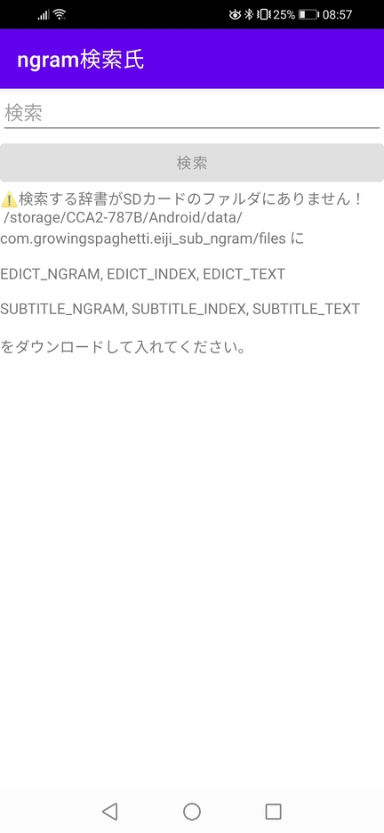

# ngram検索氏

[パソコンの全文検索ソフトeiji-sub-ngram](https://qiita.com/ryodzilla/items/e107a3dbd1b132ff95a1#ngram%E7%B4%A2%E5%BC%95fs%E7%89%88)のAndroidアプリ版

SDカードの10GB容量と引き換えにスマホで高速全文検索機能を利用できる。

パソコンの方で英辞郎と例辞郎のngram索引を作れば、それらSDカードのフォルダに入れることで追加で利用できる。

案内が出るが、まず、3GBくらいのEDICTとSUBTITLEデータが利用できるので、[データの入っているzipをダウンロード](https://github.com/growingspaghetti/websters-1913-console-dictionary/releases/tag/v0.6.0) してAndroidソフトに案内されたとおりSDカードのフォルダに入れる。

 

 

